# [practice-javafx](http://shinsakamoto.github.io/practice-javafx/)

These are samples for learning about JavaFX.

[Web Site](http://shinsakamoto.github.io/practice-javafx/)

## Basic
#### src/samples/javafx/base/App1Simple.java
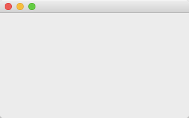
#### src/samples/javafx/base/App2BorderPane.java
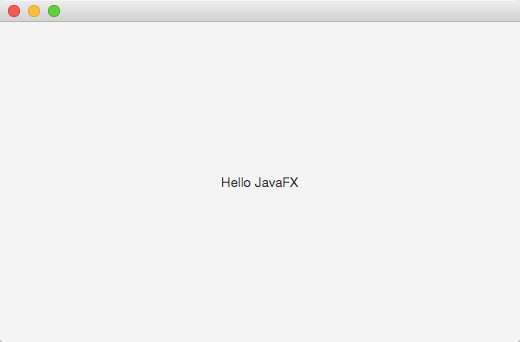
#### src/samples/javafx/base/App3FlowPane.java
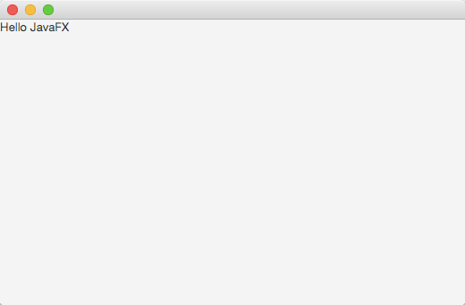
#### src/samples/javafx/base/App4VBoxHbox.java
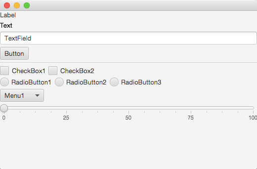
#### src/samples/javafx/base/App5EventHandler.java
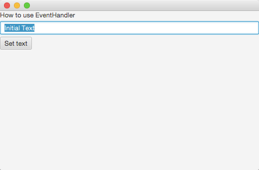
#### src/samples/javafx/base/App6EventHandlerWithLambda
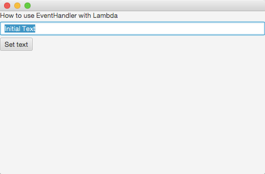
#### src/samples/javafx/base/App7FXML.java
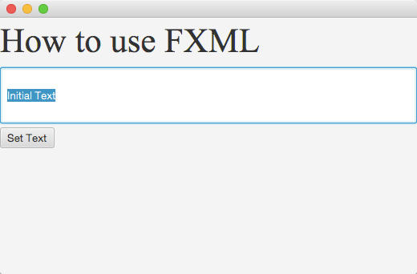
#### src/samples/javafx/base/App8FXML.java
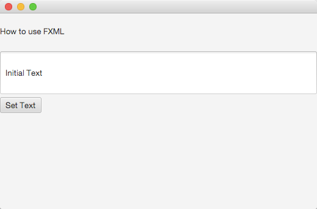
#### src/samples/javafx/base/App9FXML.java

## Shape
#### Simple Shape
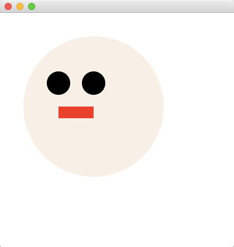
#### Animation  
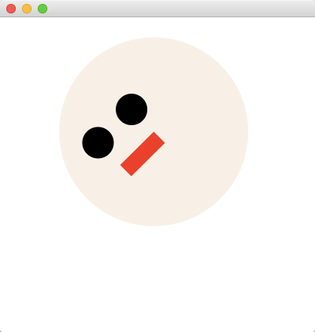

## Canvas
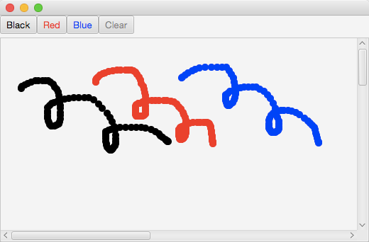

## System Tray App
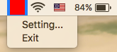
